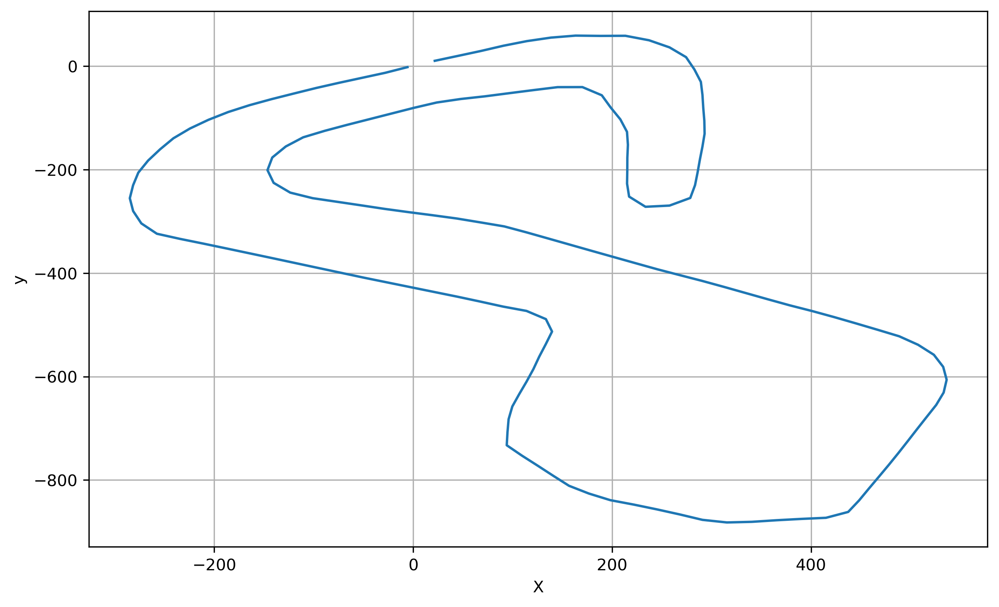

# BGRacing_2026

  

## ROS2 data processing pipeline

  

The project uses ROS2 and then connects between a ROS publisher and a subscriber.

The publisher aquires the data from BrandsHatchLayout.csv, processes it and then publishes the data to the subscriber.

The subscriber then interpolates the data using cubic splines and then then plots the data.

The resulting data is saved as result.png in the output directory.

  

## The result should look like this

  

  

## installation instructions

  

### requirements

  

Docker version 29.1.1

Ubuntu 24.04

  

### how to install

  

1. clone the repository with git.

2. open the repository in a terminal and execute `mkdir ros2_plots`

3. open the directory of the subscriber - `cd basic_subscriber`

4. build the image with docker - `docker build -t basic_subscriber .`

5. open another terminal, and then do the command `cd basic_publisher`

6. build the second image with docker `docker build -t basic_publisher`

7. create a network `docker network create ros2_net`

8. in the terminal of the subscriber, execute `docker run --rm -it --net=ros2_net -v ../ros2_plots:/ros2_ws/output basic_subscriber`

9. in the terminal of the subscriber, execute `docker run --rm -it --net=ros2_net basic_publisher`

10 The code should then execute and the picture will be in ros2_plots/output.png